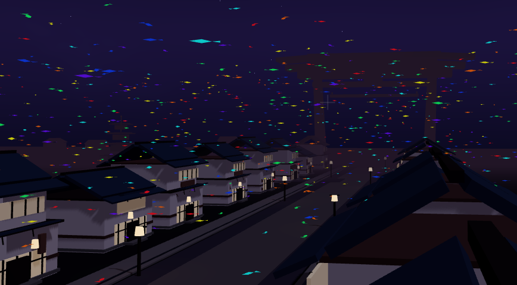

# 既視感のあるワールド




## 概要

`既視感のあるワールド` は、XRift プラットフォーム向けに制作された和風ナイトシーンの WebXR ワールドです。京都の夜景を思わせる町家の街並み、灯籠、鳥居、五重塔を軸に、ライブステージ、発光する魚、空中ビデオスクリーン、鳥居間テレポートを組み合わせた回遊型の空間になっています。

## 特徴

- 京都風の夜景街区と広い道路網で構成された和風ワールド
- 小鳥居と大鳥居を行き来できるテレポートポータル
- ライブステージと空中配置の `VideoPlayer`
- 夜空を泳ぐ発光する魚のビジュアル演出
- レイアウト崩れを防ぐテスト付きの構成

## 技術スタック

- React 19
- TypeScript 5
- Vite 7
- `@react-three/fiber`
- `@react-three/drei`
- `@react-three/rapier`
- `three`
- `@xrift/world-components`

正確な依存関係とバージョンは [package.json](package.json) を参照してください。

## セットアップ

```bash
npm install
npm run dev
```

開発サーバーは `http://localhost:5173` で起動します。

## 開発コマンド

```bash
# 開発サーバー
npm run dev

# 型チェック
npm run typecheck

# レイアウトテスト
npm test

# 本番ビルド
npm run build

# ビルド結果のプレビュー
npm run preview
```

XRift へアップロードする場合は、必要に応じて `xrift login` を行ったうえで `xrift upload` を実行してください。

## ワールド構成

- [src/World.tsx](src/World.tsx)
  - フォグ、ライティング、スポーン地点、テレポートポータル、ライブステージ背面の動画スクリーンを配置
- [src/components/KyotoNightDistrict.tsx](src/components/KyotoNightDistrict.tsx)
  - 地面、町家、郊外建物、灯籠、鳥居、五重塔など街区全体を構成
- [src/components/NightSkybox.tsx](src/components/NightSkybox.tsx)
  - 夜空の見た目を担当
- [src/components/LiveStage/index.tsx](src/components/LiveStage/index.tsx)
  - ステージエリアを構成
- [src/components/GlowingFish/index.tsx](src/components/GlowingFish/index.tsx)
  - 夜空を回遊する発光魚の演出
- [src/components/TeleportPortal/index.tsx](src/components/TeleportPortal/index.tsx)
  - ポータル表示とテレポート処理
- [src/constants.ts](src/constants.ts)
  - 配色、座標、建物配置、街路寸法などの定義

## テスト

- [tests/world-layout.test.mjs](tests/world-layout.test.mjs)
  - スポーン位置、街路幅、町家の並び、ランドマーク配置、夜景カラー、空の描画方針などを検証

## アセット

- サムネイル: `public/thumbnail.png`
- ステージ映像: `src/World.tsx` 内で外部動画 URL を指定

## ディレクトリ構成

```text
japanese-world/
├── public/
│   └── thumbnail.png
├── src/
│   ├── components/
│   │   ├── GlowingFish/
│   │   ├── LiveStage/
│   │   ├── TeleportPortal/
│   │   ├── KyotoNightDistrict.tsx
│   │   └── NightSkybox.tsx
│   ├── World.tsx
│   ├── constants.ts
│   ├── dev.tsx
│   └── index.tsx
├── tests/
│   └── world-layout.test.mjs
├── package.json
├── vite.config.ts
└── xrift.json
```

## 開発メモ

- アセットを追加する場合は `public/` に配置してください
- アセット読み込み時は `useXRift()` から取得した `baseUrl` を使い、`${baseUrl}path` の形式で結合してください
- `xrift.json` では重力 `9.81`、無限ジャンプ許可 `true` が設定されています

## ライセンス

MIT
